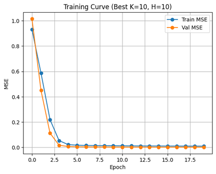
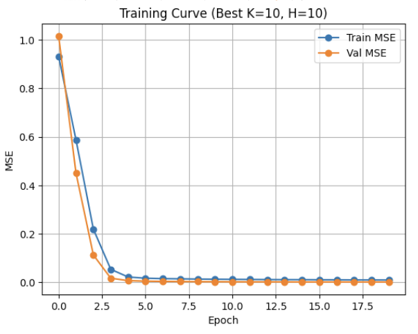
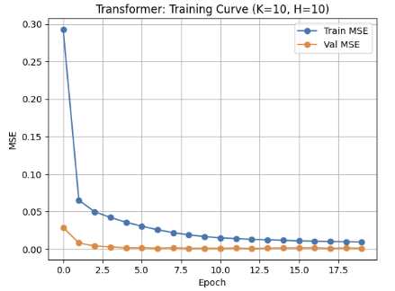
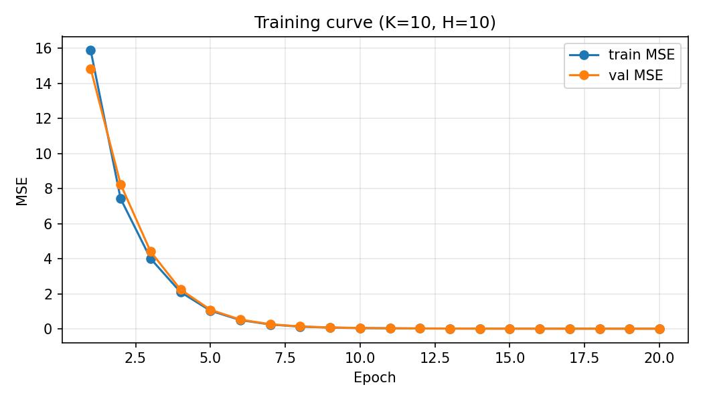
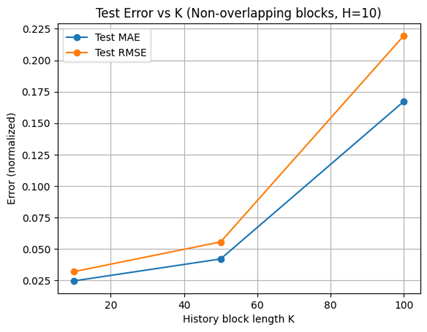
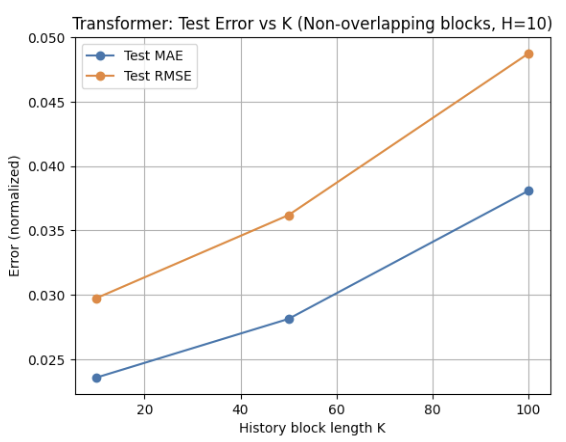
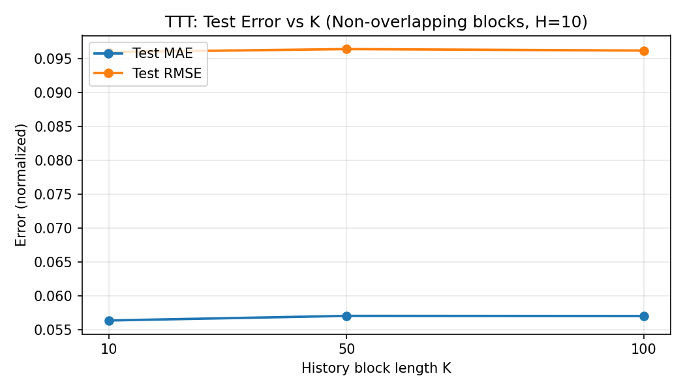
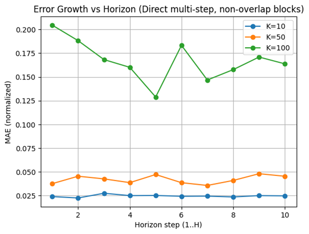
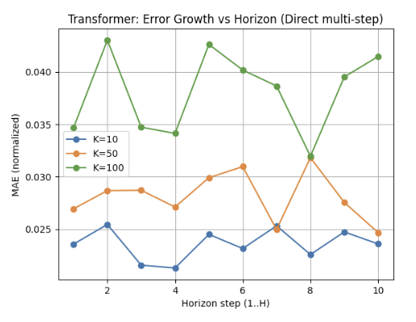
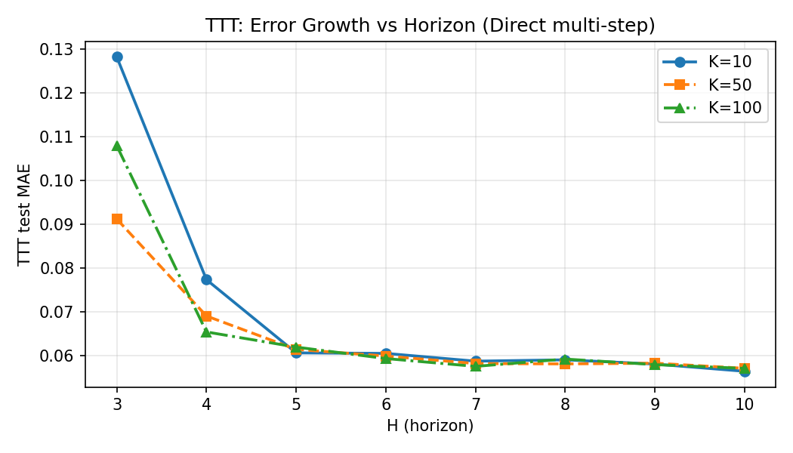

# Sequence Modeling Approaches for Robotic Arm Trajectory Prediction

This repository contains the implementation and experimental results for **multi-step robotic arm trajectory prediction** using four sequence modeling approaches:

- **RNN**
- **LSTM**
- **Transformer**
- **Test-Time Training (TTT)**

The project provides a unified empirical comparison of these models under the same preprocessing pipeline, training setup, and evaluation protocol on a robotic arm trajectory dataset.

---

## Overview

Accurate trajectory prediction is essential for robotic manipulation, motion planning, and control. In this project, we study how different sequence models behave when forecasting future robotic arm states from past observations.

We focus on three main questions:

1. How do recurrent models compare with attention-based and adaptive models?
2. How sensitive are different models to the input history length?
3. How does prediction error evolve across the forecasting horizon?

Our experiments show that:

- **Vanilla RNN** suffers severe degradation when the input history becomes long.
- **LSTM** is more stable than RNN, but still degrades with increasing history length.
- **Transformer** achieves stronger overall accuracy and better robustness to longer contexts.
- **TTT** achieves the most stable performance and the lowest overall error, showing the benefit of adaptive hidden-state updates.

---

## Problem Setting

We formulate robotic trajectory prediction as a **supervised sequence-to-sequence forecasting task**.

Given a fixed history window of past robot states,

\[
X_t = [x_{t-K+1}, x_{t-K+2}, \ldots, x_t],
\]

the model predicts a future sequence over horizon \(H\),

\[
Y_t = [x_{t+1}, x_{t+2}, \ldots, x_{t+H}].
\]

Each state corresponds to the joint configuration of a robotic arm with 3 degrees of freedom.

---

## Dataset

We use the **Robotic Arm Trajectories** dataset from Kaggle.

### Dataset characteristics
- Real-world robotic manipulator motion data
- Approximately \(1.5 \times 10^5\) time steps
- 3-dimensional state vector per time step
- Uniform temporal sampling

### Preprocessing
- Chronological train / validation / test split:
  - 70% training
  - 15% validation
  - 15% test
- Feature normalization using training-set statistics only
- Non-overlapping sequence blocks of length \(K + H\)

---

## Models

### 1. RNN
A vanilla recurrent neural network is used as the baseline sequence model. It updates a hidden state recursively and uses the final hidden representation to predict future states.

**Key property:** simple and lightweight, but highly vulnerable to vanishing gradients for long histories.

### 2. LSTM
The LSTM extends the vanilla RNN with gated memory mechanisms that improve long-range information retention.

**Key property:** more stable than RNN, but still sensitive to very long context windows.

### 3. Transformer
The Transformer models temporal dependencies using self-attention over the full input sequence.

**Key property:** captures long-range interactions more effectively and is less sensitive to sequential bottlenecks.

### 4. Test-Time Training (TTT)
TTT treats the hidden state as the parameters of a small internal learner and updates it online through self-supervised adaptation.

**Key property:** combines linear-time sequence processing with adaptive hidden-state updates, leading to strong robustness and the best overall performance in this task.

---

## Experimental Setup

We evaluate all models under a unified framework.

### Input / output settings
- History lengths: `K = 10, 50, 100`
- Prediction horizons: `H = 10, 50, 100`
- Main comparison shown at `H = 10`

### Training setup
- Optimizer: **AdamW**
- Learning rate: `1e-3`
- Weight decay: `1e-4`
- Batch size: `256`
- Epochs: `20`

### Evaluation metrics
- **MAE** (Mean Absolute Error)
- **RMSE** (Root Mean Squared Error)
- **MSE** for final model comparison

---

## Training Dynamics

We compare convergence behavior across all four architectures under the setting `K = 10, H = 10`.

- **RNN** converges relatively slowly.
- **LSTM** converges faster than RNN, showing the benefit of gated memory.
- **Transformer** converges more gradually but achieves the lowest training and validation loss.
- **TTT** also shows stable optimization and strong generalization behavior.

### RNN

### LSTM

### Transformer

### TTT

---

## Effect of History Length

We analyze how performance changes with different history lengths while fixing the prediction horizon at `H = 10`.

- **RNN** performs best at `K = 10`, but degrades dramatically as `K` increases.
- **LSTM** also performs best at `K = 10`, with noticeable degradation for longer histories.
- **Transformer** remains much more stable as context grows.
- **TTT** is the most robust to history length and shows almost no performance drop.

### Interpretation
Longer context does **not necessarily** improve prediction. In this task, distant past observations may introduce weakly relevant or noisy information, which can hurt generalization.

### RNN / LSTM history-length trend

### Transformer history-length trend

### TTT history-length trend

---

## Multi-step Forecasting Behavior

We further analyze how prediction error changes across the forecasting horizon.

- **RNN** becomes unstable for long histories.
- **LSTM** shows gradual error growth with the prediction horizon, which is typical in multi-step forecasting.
- **Transformer** maintains relatively low and stable error across horizon steps.
- **TTT** behaves differently: early predicted steps may have higher error, but the error quickly stabilizes and remains consistent over later steps.

### Interpretation
Direct multi-step prediction reduces recursive error accumulation, especially for Transformer and TTT.

### RNN / LSTM horizon trend

### Transformer horizon trend

### TTT horizon trend

---

## Quantitative Comparison

Final MSE comparison for `H = 10`:

| K   | RNN   | LSTM  | Transformer | TTT |
|-----|------:|------:|------------:|----:|
| 10  | 0.035 | 0.032 | 0.030       | **0.0092** |
| 50  | 0.083 | 0.056 | 0.036       | **0.0093** |
| 100 | 0.223 | 0.219 | 0.049       | **0.0093** |

### Takeaway
TTT consistently achieves the lowest MSE across all tested history lengths, while Transformer is the strongest non-adaptive baseline.

---

## Key Findings

- Increasing context length alone does not guarantee better trajectory prediction.
- Recurrent models are highly sensitive to irrelevant or weakly correlated long-range information.
- Self-attention improves robustness by directly accessing relevant temporal information.
- Adaptive hidden-state updates in TTT provide the strongest overall performance.

